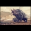

Imágenes:
_________

_para crear imágenes html, como , debemos de crear un signo de esclamación "!"

_seguido de corchetes [], dentro de los cuáles debemos indicar el texto alternativo de la imágen

_para a continuación en paréntesis "()", indicar la ruta de la imágen ha cargar

     

_más también, tendremos la posibilidad en operaciones repetitivas de imágenes iguales de ésta manera, podremos estandarizar las imágenes ha modo de instancias, ej; del enlace "MONO"

La empresa ![ Logo_Mono][markdown] está dedicada al diseño gráfico con los mejores estándares de producción por ésta razón ![ Logo_Mono][markdown] tiene aplicaciones en diseño web, 3d, producción, otros. Ya que ![ Logo_Mono][markdown] es una empresa polifacética así, ![ Logo_Mono][markdown] tiene a tu disposición múltiples servicios, entra ha ![ Logo_Mono][markdown] y conoce más..

[markdown]: img/CG.jpg

_de ésta manera, como podremos ver ahora sólo tubimos que enmarcar el texto alternativo de la imágen dentro de corchetes en las diferentes instancias

_así, como también, de forma contigua tuvimos que enmarcar en conchetes la palabra clave "markdown"

_para posteriormente sólo tener que volver ha escribir la palabra markdown, entre corchetes [] una vez más seguida de dos puntos ":", y a continuación la ruta URL, de la ruta de la imágen respectiva

